# Sankalp

Use the app [here](https://sankalp-one.vercel.app)!

Check out demo [here](https://youtu.be/ZZddluzInkI?si=R0ijkjIWCf1E_gb_)!

This GitHub repository is available [here](https://github.com/ChandradithyaJ/Sankalp)!

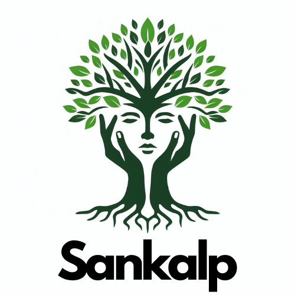

## Table of Contents

- [Project Overview](#project-overview)
- [Team Information](#team-information)
- [Problem Statement](#problem-statement)
- [Application Features](#application-features)
  - [Story Mode](#story-mode)
  - [Badges](#badges)
  - [User Authentication](#user-authentication)
  - [Report and Suggestion](#report-and-suggestion)
  - [Dark Mode](#dark-mode)
  - [Live News Feed](#live-news-feed)
  - [Therapy Chatbot](#therapy-chatbot)
  - [Multilingual Support](#multilingual-support)
- [Upcoming Features](#upcoming-features)
- [Setting up](#setting-up-a-server)
  - [Environment Configuration](#environment-configuration)
- [Usage](#usage)
- [Technologies Used](#technologies-used)
- [Design and Development Decisions](#design-and-development-decisions)
- [Alignment with SDG Goals](#alignment-with-goals)
- [License](#license)
- [Contact](#contact)

## Project Overview

Welcome to the **Sankalp** Web Application repository! This web application is dedicated to addressing the challenges faced by individuals with mental health issues and disabilities. It aims to break stereotypes and promote understanding while providing valuable features to support users. This project is built with MERN stack.

## Team Information

- **Team Name:** SE_2023 Team 11
- **Team Members and Contributions:**
  - Karthikeya - Story Mode UI, Update Profile UI, Chatbot Integration, Home Page Timeline, Text animation, App Logo, README
  - Arpit - Home Page UI, News API Integration + UI, Contact Us Page, Chatbot Integration, UML diagrams, App Logo
  - Manurbhav - Navbar (web and mobile), Home Page Timeline, Authentication, Pages UI, Animations
Chatbot Integration
  - Chandradithya - Node + Express Backend (MVC Pattern), MongoDB Integration, Story Mode, Profile Page, Cloudinary API Integration, Multilingual Translation, Hosting/Deployment
Story Collection
  - Nandhavardhan - Node + Express Backend (MVC Pattern), Chatbot Integration, JWTs Integration for Authentication and Authorization, Update Profile UI, README, Story Collection

## Problem Statement

People with mental health issues and disabilities are often misunderstood and stigmatized, leading to poor treatment and discrimination. This can have a significant impact on their mental and emotional well-being.

**Sankalp** aims to raise awareness and understanding of mental health issues and disabilities. Its features include a story mode to help users empathize with those facing these challenges, a therapy chatbot for support, and an experimental sentiment analysis tool to track users' mental states.

This is a singularly unique problem since many apps focus on people with mental health issues and not much on the people who interact with them. This app aims to bridge that gap.

## Application Features

### Story Mode

- Users can explore the experiences of individuals with mental health issues and disabilities.
- Modules provide module descriptions and track user progress.
- Provides insights into how users' words and actions can positively or negatively affect others.
- If a disrespectful option is chosen in the story mode, the app encourages users to reconsider or provides an explanation for the inappropriateness.
- Badges provided for completion of stories.
- Get at least 80% of the total score the successfully finish the story

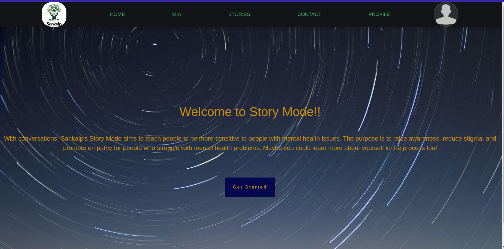

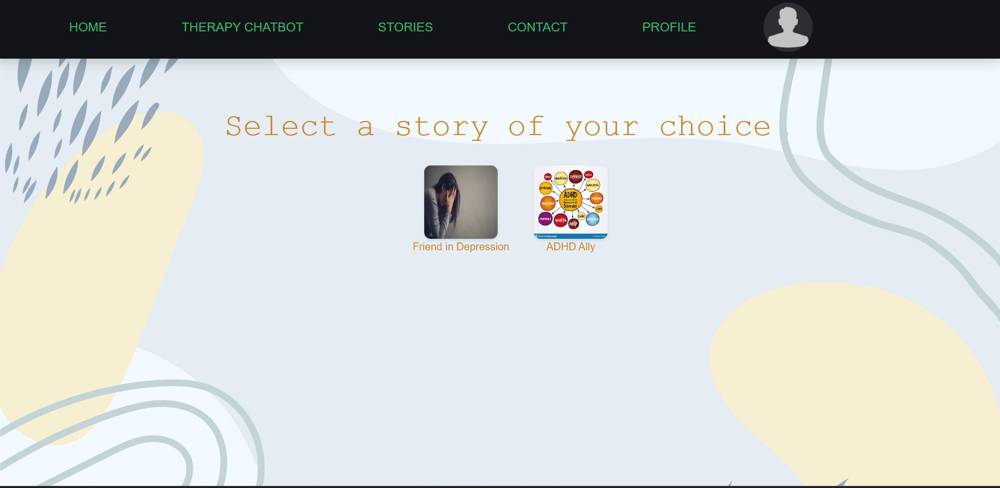

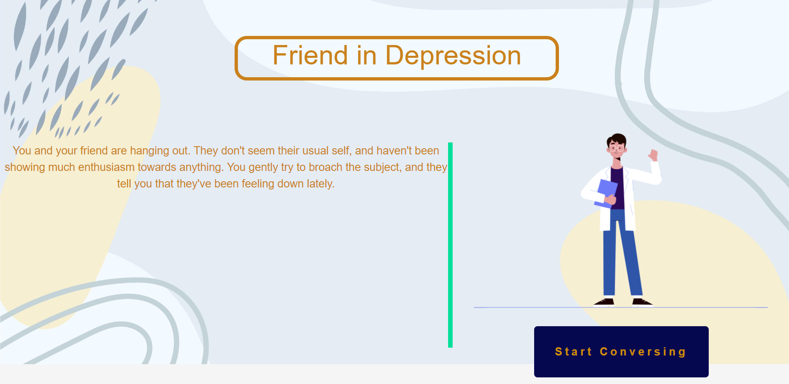

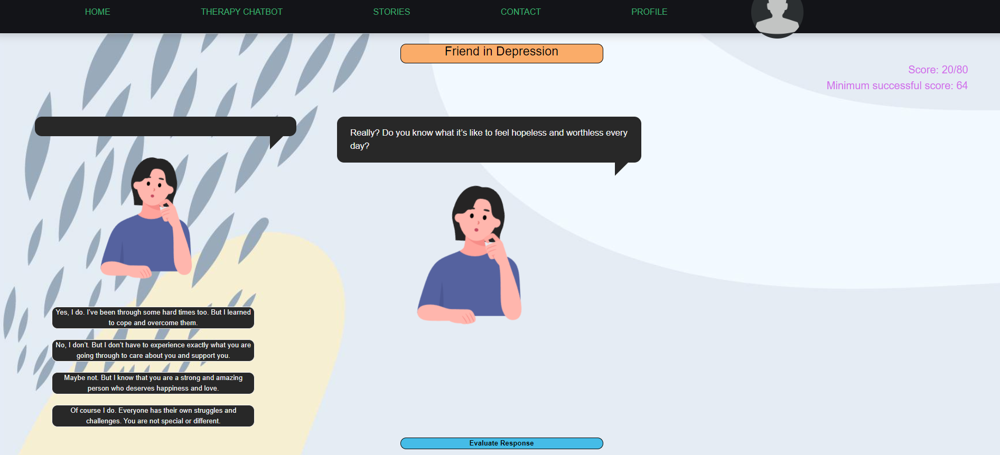

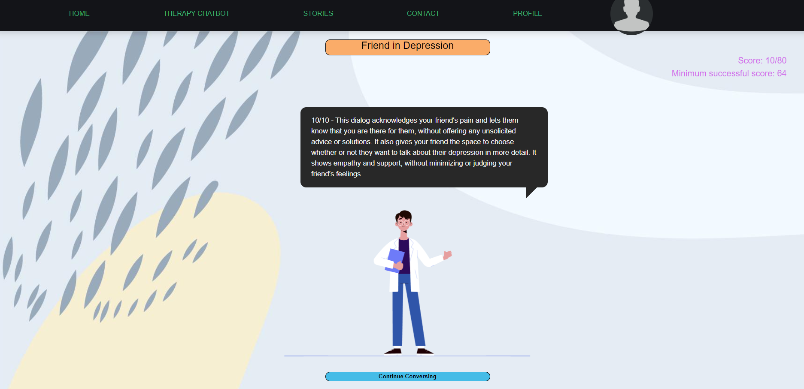

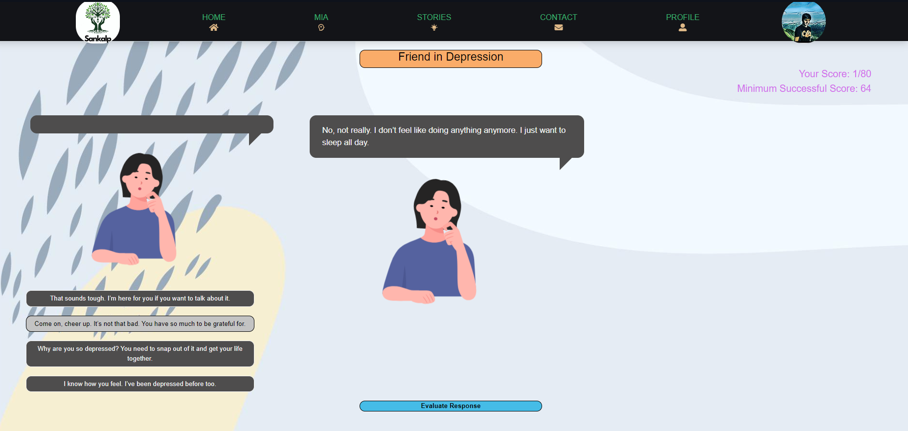

### Badges
  - Recognition for user achievements, like completion of stories.
  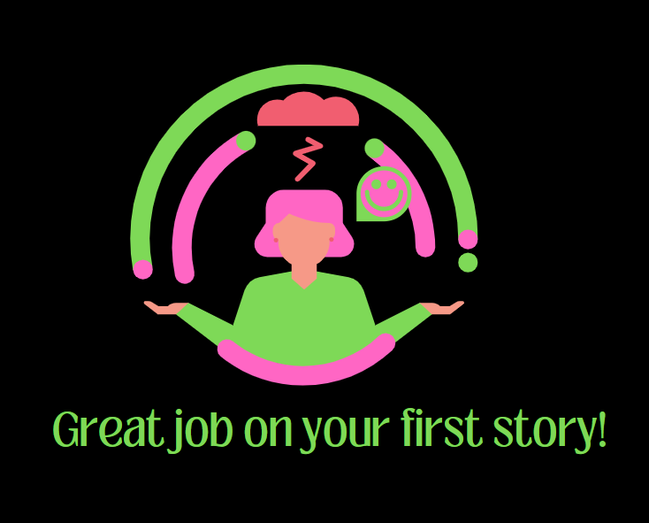
  

### User Authentication

- Basic login, logout, and registration functionality.
- Secure storage of user data and preferences.
- Allows users to personalize their profiles with customizable profile pictures.

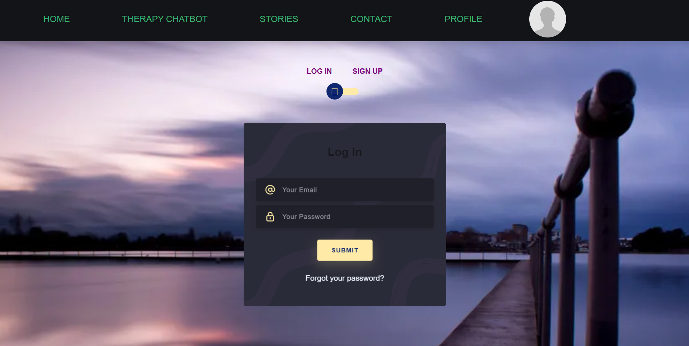

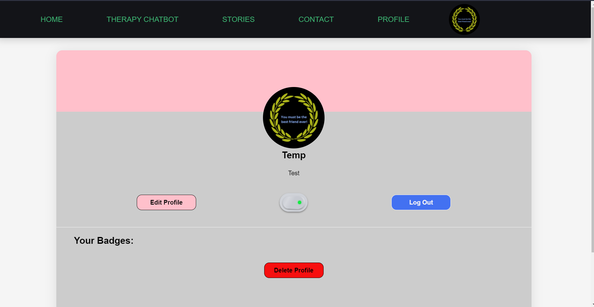
### Report and Suggestion

- Allows users to report issues or suggest improvements directly to the development team.

### Dark Mode

- Enables users to customize the app's theme with light or dark mode.
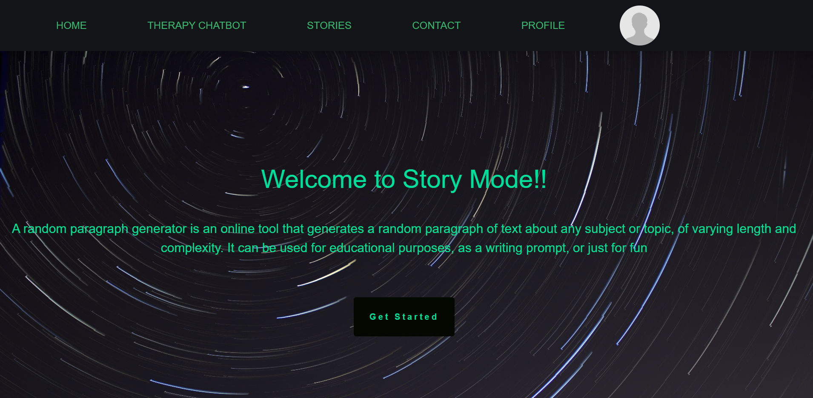

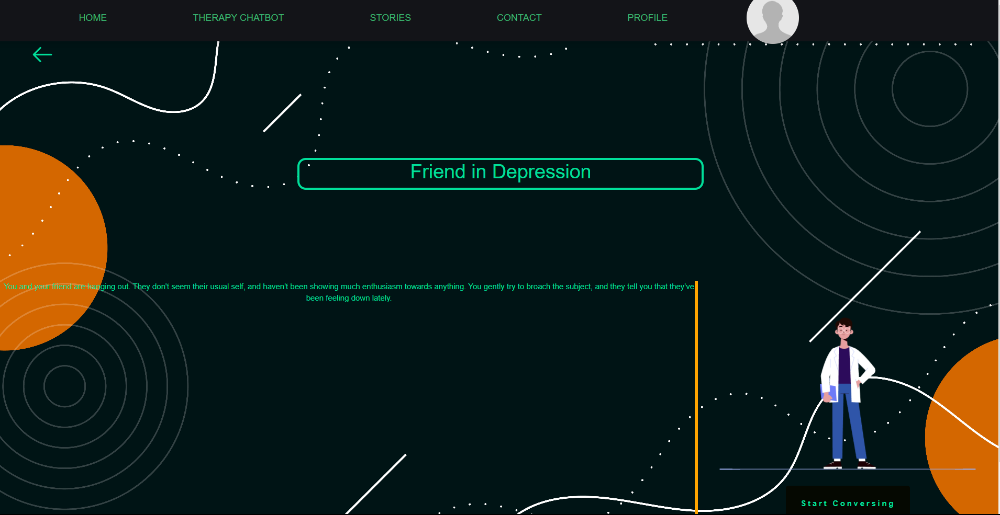

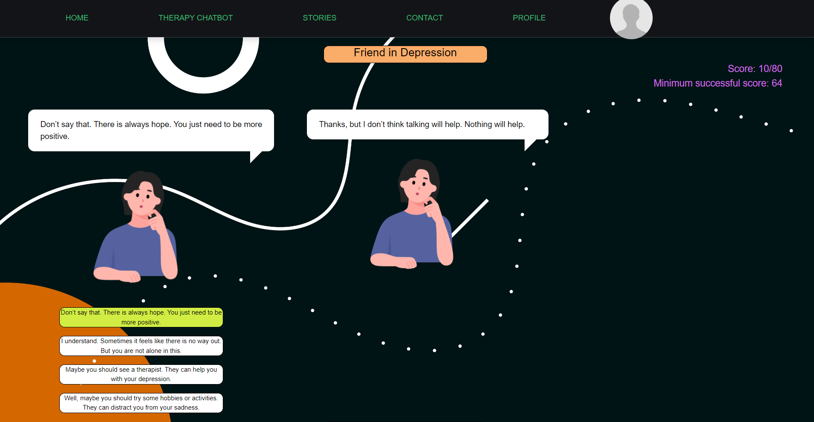

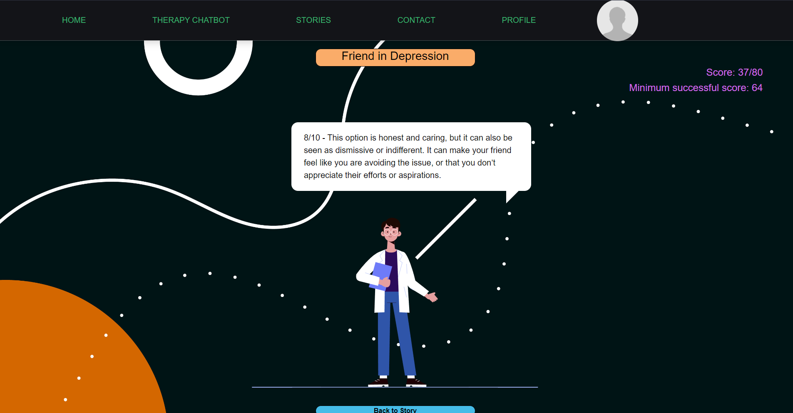

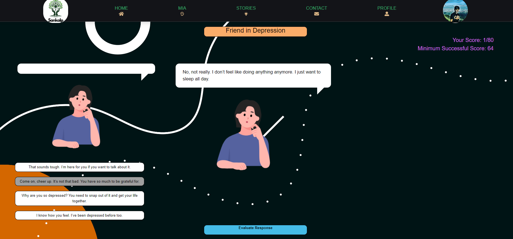

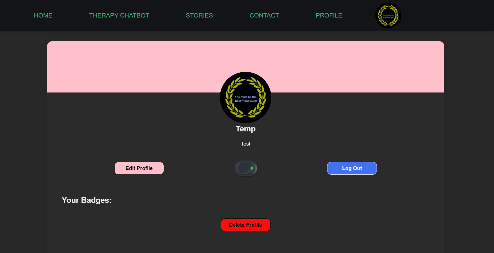

### Live News Feed
- Keeps users informed with recent news on mental health and related matters.
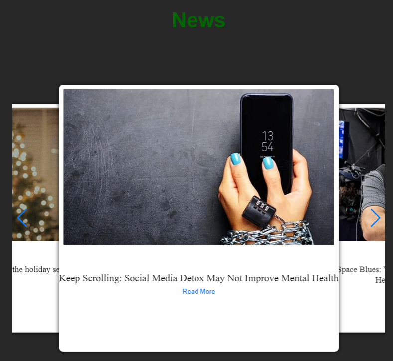

### Therapy Chatbot
-  Integration of a chatbot to assist users in understanding concepts related to mental health and disabilities
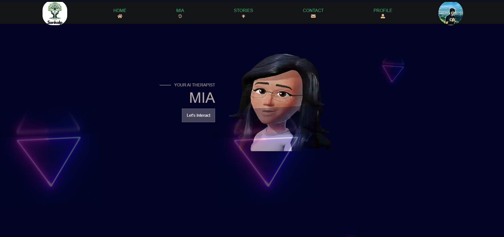

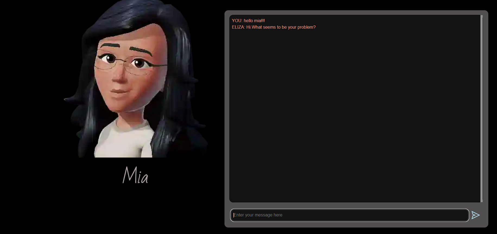

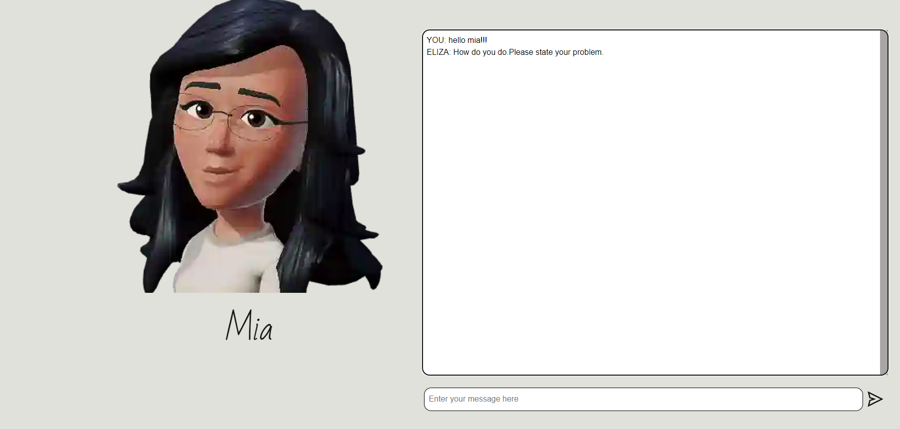

### Multilingual Support
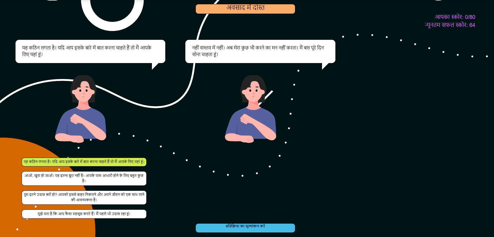

## Upcoming Features
Please suggest recomended features in the issues section of this repository or you could also contact us at Contact us page in the website.

## Setting up a server

To set up and run the Sankalp MERN Web Application locally, follow these steps:

1. Clone this repository to your local machine: `git clone https://github.com/ChandradithyaJ/Sankalp.git`.
2. Navigate to the project folder: `cd sankalp`.
3. Install root dependencies: `npm install`. Or copy paste the following code `npm i concurrently`
4. Change directory to the client folder: `cd client`.
5. Install client dependencies: `npm install`. Or copy paste the following code `npm i @fortawesome/free-solid-svg-icons @fortawesome/react-fontawesome @fvilers/disable-react-devtools axios fontawesome gsap lottie-react picomatch postcss-preset-env react react-carousel3 react-device-detect react-dom react-icons react-jwt react-responsive-carousel react-router-dom react-scripts swiper web-vitals @iconify/react`
6. Return to the project folder: `cd ..`.
7. Change directory to the server folder: `cd server`. 8. Install server dependencies: `npm install`. Or copy paste the following code `npm i axios bcrypt bing-translate-api cloudinary cors dotenv express jsonwebtoken mongodb mongoose netlify-lambda qs serverless-http`

### Environment Configuration

1. Navigate to the Server Directory
2. Copy the `.env.sample` file to a new file named `.env`
3. Modify the values in the `.env` file to match your configuration needs.
4. In the client/src/UserProfile/UpdateProfile.js, in the handleSubmit function: change the `newProfilePic` variable to the link which will be generated by Cloudinary
5. In the server/controllers/picController.js, in the updateProfilePic function: change the `upload_preset` variable to the Cloudinary upload_preset where you store your pics
6. Please note that for the Story Mode to work, you need stories in the database which will be provided in JSON format soon. Please load them into your Mongo as per the specific instructions mentioned.

## Usage

1. Start the server and client concurrently using: `npm run start` in the root directory.
2. Access the app in your web browser at `http://localhost:3000`.

## Technologies Used
1. MERN
   - Mongo as the database
   - Node (using ExpressJS) for the Backend
   - ReactJS for the frontend
2. [News API](https://newsapi.org)
3. [Cloudinary API](https://cloudinary.com)
     - for storing the profile pics of users
4. Bootstrap (parts of the UI)
5. Lottie animations
6. Vercel (for frontend deployment)
7. Render (for backend deployment)

## Design and Development Decisions
1. We used the Waterfall effect of Express, with a JWT verification as a middleware, which allows only users with valid JWTs to access certain features such as editing profile, and story mode. Just login to get a valid JWT (this happens in the backend, so please don't worry about it).
2. MongoDB isn't a great place to store images as it has an efficient image storage system, storing them in Base64 Encoding, which slows the process of fetching user details from the database. Hence, we decide to use a third-party service, Cloudinary, to store our images, and we then store the url of that image in Mongo.
3. We keep track of progress using [GitHub Projects](https://github.com/ChandradithyaJ/Sankalp/projects)
4. Created a custom zip function (much like Python’s zip function) to traverse the stored translated dialog options simultaneously with the other conversation details (such as the points and explanation for each option) in the Story Mode.
5. Sent only the dialog options for the current conversation set to be translated to prevent the HTTP Error Code 429 Too Many Requests we received while trying to translate the whole story at once.
6. Implemented fun Toast Notifications instead of the alerts used in release 1.
7. Added icons to the Navigation Bar options as the navigation bar titles won’t be translated to maintain good UI.
8. Added loading animations after the user executes an action that requires API calls.

## Alignment with Goals

The Sankalp app aligns with Sustainable Development Goals (SDGs) 3 (Good Health and Well-Being) and 10 (Reduced Inequalities) by promoting and supporting sustainable development through recognition, exposure, and support for mental health and disabilities to be recieved well by people who interact with them.

## License

This project is licensed under the MIT License. See the [LICENSE](./LICENSE.md) file for details.

## Contact

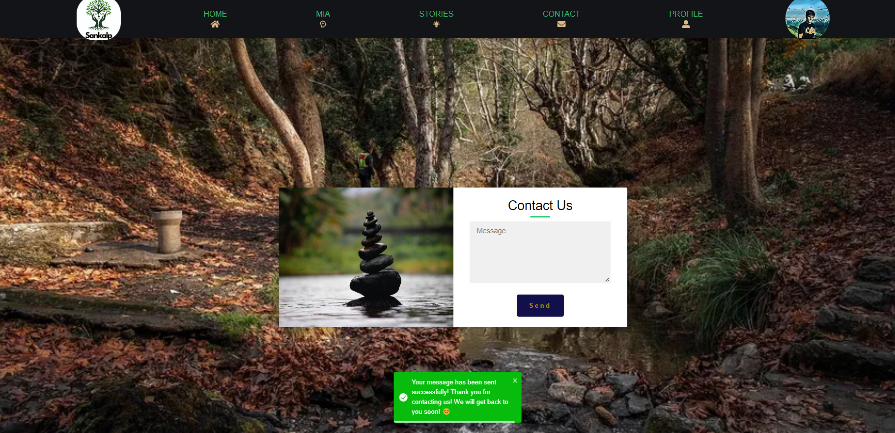

If you have questions, feedback, or need assistance, please contact us either on the contact us page or over this repository.

---

**Sankalp** - Together, we can create understanding and support for mental health issues and disabilities. Thank you for your interest and contributions!
