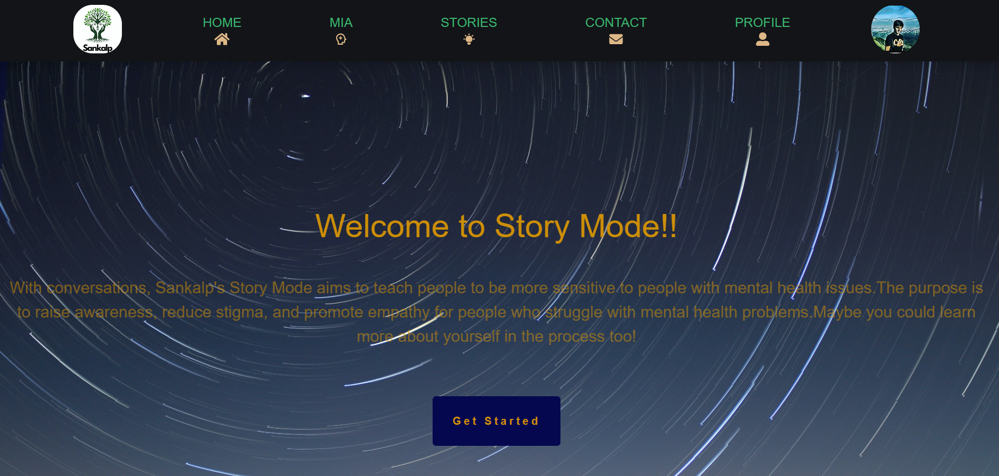
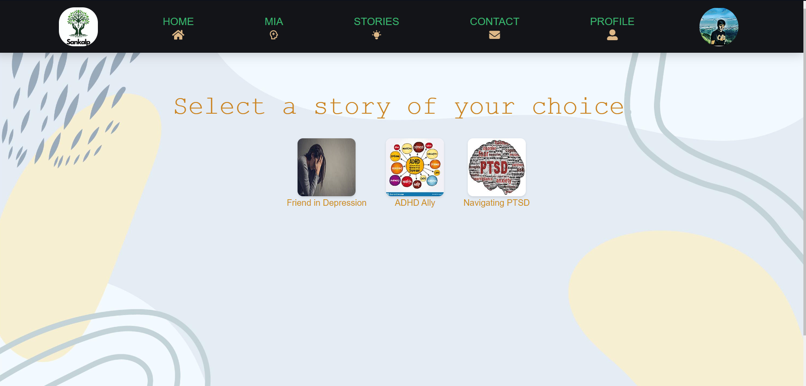
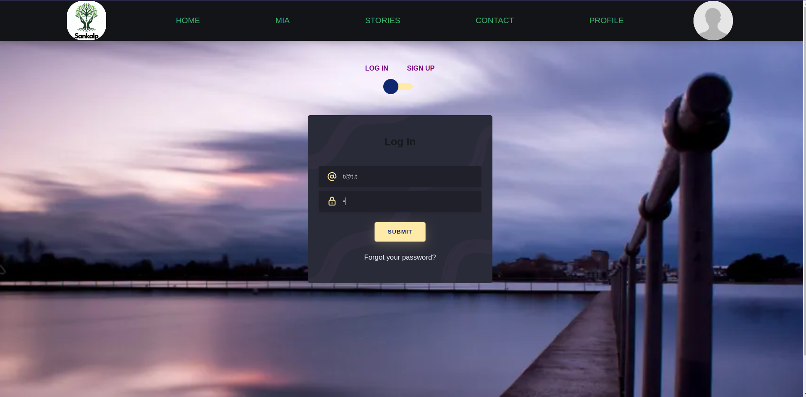
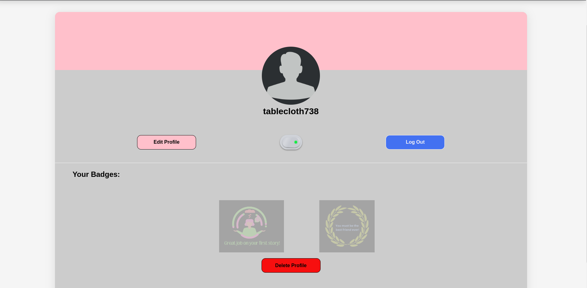
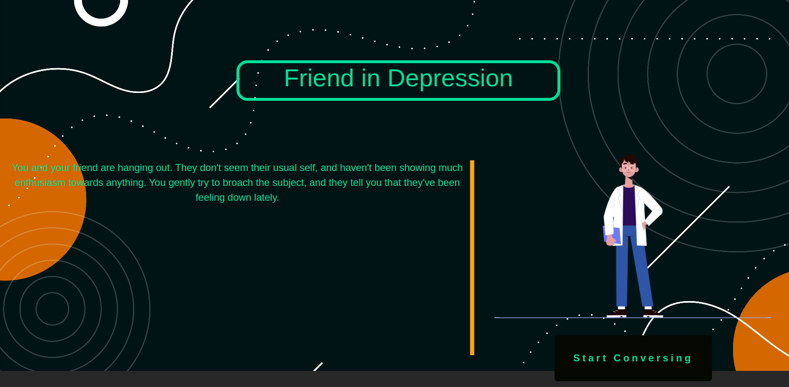
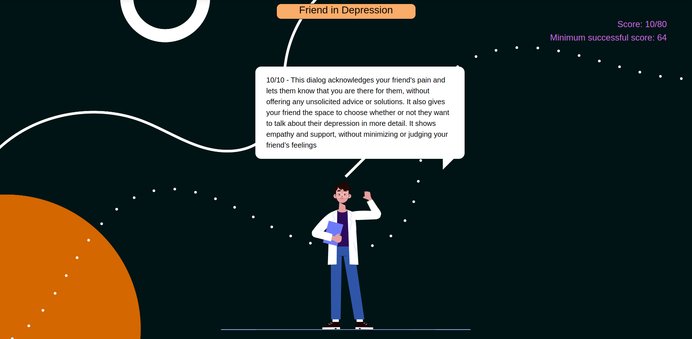
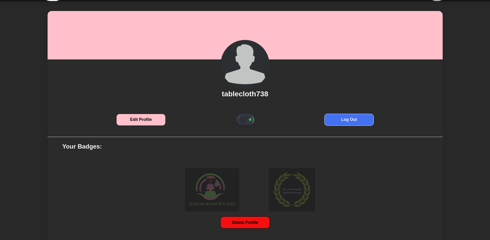

# Sankalp

Use the app [here](https://sankalp-one.vercel.app)!

This GitHub repository is available at [here](https://github.com/ChandradithyaJ/Sankalp)!

## Table of Contents

- [Project Overview](#project-overview)
- [Team Information](#team-information)
- [Problem Statement](#problem-statement)
- [Application Features](#application-features)
  - [Story Mode](#story-mode)
  - [User Authentication](#user-authentication)
  - [Report and Suggestion](#report-and-suggestion)
  - [Dark Mode](#dark-mode)
  - [Live News Feed](#live-news-feed)
- [Upcoming Features](#upcoming-features)
- [Setting up](#setting-up-a-server)
  - [Environment Configuration](#environment-configuration)
- [Usage](#usage)
- [Technologies Used](#technologies-used)
- [Design Decisions](#design-decisions)
- [Alignment with SDG Goals](#alignment-with-goals)
- [License](#license)
- [Contact](#contact)

## Project Overview

Welcome to the **Sankalp** Web Application repository! This web application is dedicated to addressing the challenges faced by individuals with mental health issues and disabilities. It aims to break stereotypes and promote understanding while providing valuable features to support users. This project is built with the MERN stack.

## Team Information

- **Team Name:** SE_2023 Team 11
- **Team Members and Contributions:**
  - Karthikeya - Story Mode UI, Home Page timeline and text animation, Update Profile UI, README, Logo
  - Arpit - Home Page UI, News API integration, Slider animation, Use case diagram, Contact Us Page, Logo
  - Manurbhav - Navbar, Story Collection, Home Page timeline, Authentication Pages UI, UI animations
  - Chandradithya - Complete Backend (MVC pattern), Cloudinary API, MongoDB integration, Story Collection, Profile Page (UI + functionality), Hosting/Deployment
  - Nandhavardhan - Backend (MVC Pattern), Story Collection, README, JWTs integrations for authentication and authorization, Update Profile UI, WSR doc

## Problem Statement

People with mental health issues and disabilities are often misunderstood and stigmatized, leading to poor treatment and discrimination. This can have a significant impact on their mental and emotional well-being.

**Sankalp** aims to raise awareness and understanding of mental health issues and disabilities. Its features include a story mode to help users empathize with those facing these challenges, a therapy chatbot for support, and an experimental sentiment analysis tool to track users' mental states.

This is a singularly unique problem since many apps focus on people with mental health issues and not much on the people who interact with them. This app aims to bridge that gap.

## Application Features

### Story Mode

- Users can explore the experiences of individuals with mental health issues and disabilities.
- Modules provide module descriptions and track user progress.
- Provides insights into how users' words and actions can positively or negatively affect others.
- If a disrespectful option is chosen in the story mode, the app encourages users to reconsider or provides an explanation for the inappropriateness.
- Badges provided for completion of stories.
- Get at least 80% of the total score the successfully finish the story

### User Authentication

- Basic login, logout, and registration functionality.
- Secure storage of user data and preferences.
- Allows users to personalize their profiles with customizable profile pictures.

### Report and Suggestion

- Allows users to report issues or suggest improvements directly to the development team.

### Dark Mode

- Enables users to customize the app's theme with light or dark mode.

### Live News Feed

- Keeps users informed with recent news on mental health and related matters.

## Upcoming Features

The Sankalp team is actively working on enhancing the app's functionality. In the near future, users can expect the following features:

- **Chatbot** Integration of a chatbot to assist users in understanding concepts related to mental health and disabilities
- **Community** A community chat/discussion platform for users, similar to r/adhd on Reddit.
- **User Gets Badges** Recognition for user achievements, including completion of stories, community participation, service, and positivity.
- **Community Moderation and Roles** The communities within the app are moderated, with roles such as user and moderator to ensure a healthy environment.
- **Multilingual Support** Language support for basic app features to cater to a diverse user base.
- **Mentality Test** A mental health assessment tool that gauges a person's mental health through social media interactions and a questionnaire.
- **Anonymous Listener and Speaker Chatrooms** Anonymous chatrooms for users to listen and speak about their experiences.

## Setting up a server

To set up and run the Sankalp MERN Web Application locally, follow these steps:

1. Clone this repository to your local machine: `git clone https://github.com/ChandradithyaJ/Sankalp.git`.
2. Navigate to the project folder: `cd sankalp`.
3. Install root dependencies: `npm install`. Or copy paste the following code `npm i concurrently`
4. Change directory to the client folder: `cd client`.
5. Install client dependencies: `npm install`. Or copy paste the following code `npm i @fortawesome/free-solid-svg-icons @fortawesome/react-fontawesome @fvilers/disable-react-devtools axios fontawesome gsap lottie-react picomatch postcss-preset-env react react-carousel3 react-device-detect react-dom react-icons react-jwt react-responsive-carousel react-router-dom react-scripts swiper web-vitals @iconify/react`
6. Return to the project folder: `cd ..`.
7. Change directory to the server folder: `cd server`. 8. Install server dependencies: `npm install`. Or copy paste the following code `npm i axios bcrypt cloudinary cors dotenv express jsonwebtoken mongodb mongoose netlify-lambda qs serverless-http`

### Environment Configuration

1. Navigate to the Server Directory
2. Copy the `.env.sample` file to a new file named `.env`
3. Modify the values in the `.env` file to match your configuration needs.
4. In the client/src/UserProfile/UpdateProfile.js, in the handleSubmit function: change the `newProfilePic` variable to the link which will be generated by Cloudinary
5. In the server/controllers/picController.js, in the updateProfilePic function: change the `upload_preset` variable to the Cloudinary upload_preset where you store your pics
6. Please note that for the Story Mode to work, you need stories in the database which will be provided in JSON format soon. Please load them into your Mongo as per the specific instructions mentioned.

## Usage

1. Start the server and client concurrently using: `npm run start` in the root directory.
2. Access the app in your web browser at `http://localhost:3000`.

## Technologies Used
1. MERN
   - Mongo as the database
   - Node (using ExpressJS) for the Backend
   - ReactJS for the frontend
2. [News API](https://newsapi.org)
3. [Cloudinary API](https://cloudinary.com)
     - for storing the profile pics of users
4. Bootstrap (parts of the UI)
5. Lottie animations
6. Vercel (for frontend deployment)
7. Render (for backend deployment)

## Design Decisions
1. We used the Waterfall effect of Express, with a JWT verification as a middleware, which allows only users with valid JWTs to access certain features such as editing profile, and story mode. Just login to get a valid JWT (this happens in the backend, so please don't worry about it).
2. MongoDB isn't a great place to store images as it has an efficient image storage system, storing them in Base64 Encoding, which slows the process of fetching user details from the database. Hence, we decide to use a third-party service, Cloudinary, to store our images, and we then store the url of that image in Mongo.
3. We keep track of progress using [GitHub Projects](https://github.com/ChandradithyaJ/Sankalp/projects)

## Alignment with Goals

The Sankalp app aligns with Sustainable Development Goals (SDGs) 3 (Good Health and Well-Being) and 10 (Reduced Inequalities) by promoting and supporting sustainable development through recognition, exposure, and support for mental health and disabilities to be recieved well by people who interact with them.

## License

This project is licensed under the MIT License. See the [LICENSE](./LICENSE.md) file for details.

## Contact

If you have questions, feedback, or need assistance, please contact us either on the contact us page or over this repository.

---

**Sankalp** - Together, we can create understanding and support for mental health issues and disabilities. Thank you for your interest and contributions!
